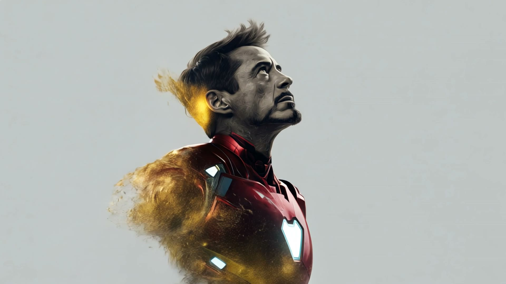
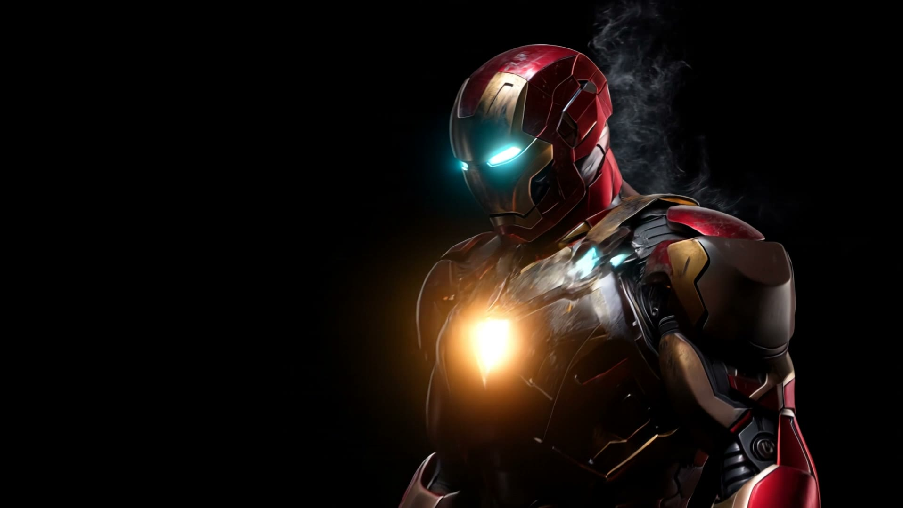
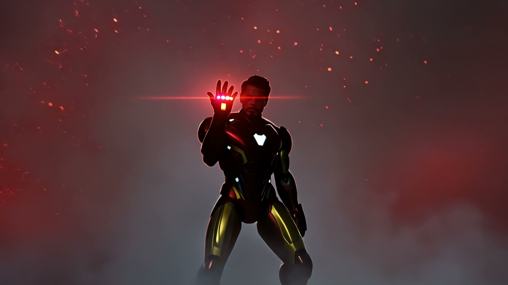
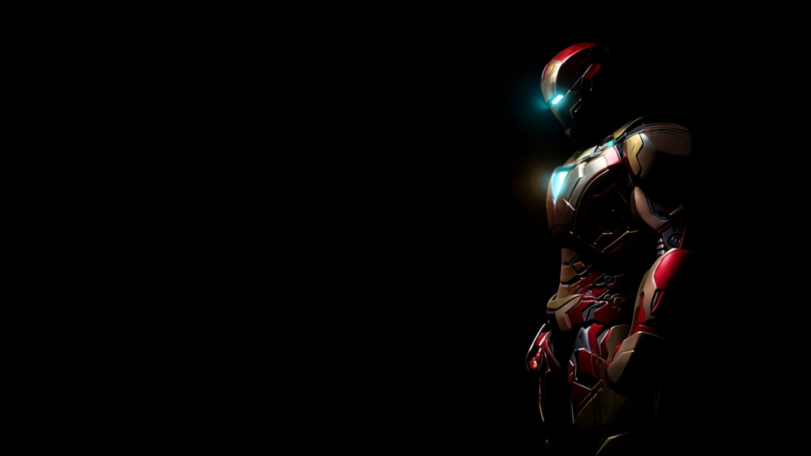

# ⚡ Stark Industries — Mark LXXXV Portfolio



An immersive, high-tech interactive web experience dedicated to Tony Stark's Mark LXXXV Nanotech Suit and Stark Industries engineering. Built with modern web technologies including Next.js 16, React 19, TypeScript, Framer Motion, and Lenis smooth scrolling.

---

## 🌟 Visual Preview & Key Features

### 🎬 Cinematic Scroll Experience

- Interactive frame-by-frame scroll reveal of the Mark LXXXV Nanotech assembly and Endgame suit sequence.

---

### 🛡️ Hall of Armor Vault

- Interactive suit showcase covering iconic armors (**Mark I, Mark III, Mark VII, Mark XLIV Hulkbuster, Mark L, Mark LXXXV**).
- Includes suit image previews, category filters, and live performance metrics.

---

### 💻 J.A.R.V.I.S. Interactive Console

- Live suit diagnostic control panel with nanotech matrix toggles.
- Arc Reactor power surge simulator, defense protocol switches, and real-time HUD terminal logs.

---

### 📊 Systems Nominal Telemetry
- Real-time readouts for suit integrity, Arc reactor output, flight ceiling, and neural interface latency.
- Stark gold accents, glassmorphic card overlays, micro-animations, and custom HUD frame corner markers.

---

## 🛠️ Technology Stack

- **Framework**: [Next.js 16](https://nextjs.org/) (App Router, Turbopack)
- **UI Library**: [React 19](https://react.dev/)
- **Language**: [TypeScript](https://www.typescriptlang.org/)
- **Styling**: [Tailwind CSS v4](https://tailwindcss.com/)
- **Animations**: [Framer Motion](https://www.framer.com/motion/)
- **Smooth Scroll**: [Lenis](https://lenis.darkroom.engineering/)
- **Icons**: [Phosphor Icons](https://phosphoricons.com/)

---

## 🚀 Getting Started

### Prerequisites

Ensure you have Node.js 18+ installed on your system.

### 1. Clone the Repository

```bash
git clone https://github.com/Logakarthick2004/Iron-man.git
cd Iron-man
```

### 2. Install Dependencies

```bash
npm install
```

### 3. Run Development Server

```bash
npm run dev
```

Open [http://localhost:3000](http://localhost:3000) in your browser to view the project.

### 4. Build for Production

```bash
npm run build
npm start
```

---

## 📁 Project Structure

```
iron-man/
├── public/
│   ├── frames/          # Frame sequence images for Mark LXXXV assembly
│   └── frames2/         # Frame sequence images for Endgame sequence
├── src/
│   ├── app/
│   │   ├── globals.css  # Global Tailwind styles and CSS variables
│   │   ├── layout.tsx   # Root layout and metadata configuration
│   │   └── page.tsx     # Main application page
│   ├── components/
│   │   ├── providers/   # Smooth scroll context providers
│   │   ├── sections/    # Hero, CinematicReveal, SystemsNominal, ArmorGallery, JarvisTerminal, Footer
│   │   └── ui/         # Reusable UI components (Navbar, EyebrowBadge, HudFrame, AnimatedSection)
│   └── lib/             # Data models and frame sequence utilities
├── next.config.ts       # Next.js configuration
├── package.json         # Project scripts and dependencies
└── tsconfig.json        # TypeScript configuration
```

---

## 📜 Disclaimer

Proof of concept & fan art. Iron Man and related characters are trademarks of Marvel Studios & Marvel Entertainment. No commercial use intended.
